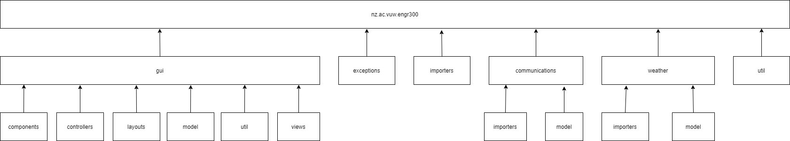
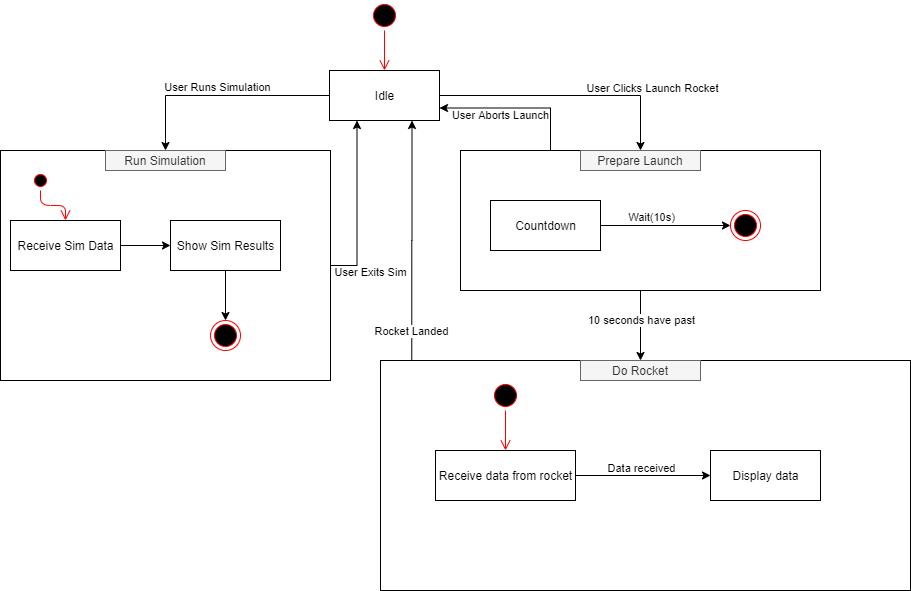
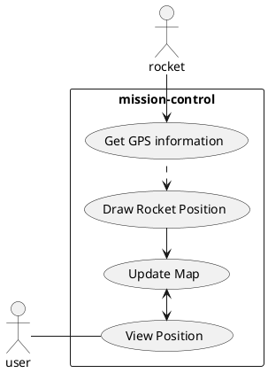
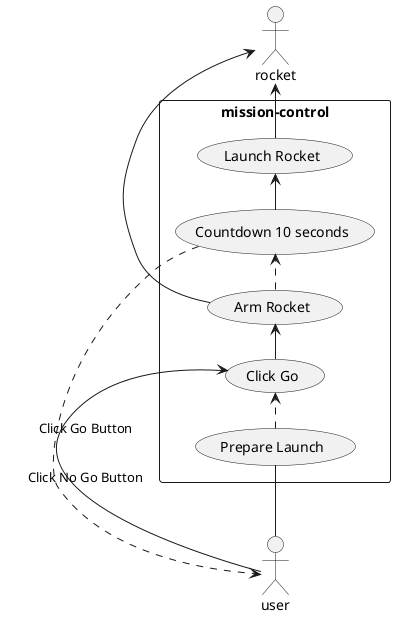

# ENGR 301 *Project 10* Architectural Design and Proof-of-Concept

**Authors:** Nathan Duckett, Timothy Salisbury, Ahad Rahman, Joshua Harwood, Nalin Aswani, Jake (Quang) Mai.

## 1. Introduction

Hobby rockets are very common worldwide, they are typically flown with off the shelf rocket motors with widely available propellant reloads. These hobby rockets can reach the altitude between 30 meters and 760 meters, with velocities exceeding the speed of sound. Uncontrolled rockets are stable based on passive aerodynamic features.
This project will however focus on a controlled rocket, primarily the Mission Control software system. The rocket hardware is designed and built upon the idea of self-stabilization from the Avionics and Control team. The Mission Control software will consider external environmental factors potentially affect the launch such as wind speed, temperature, humidity, rain to decide whether it is safe to launch. On top of that, the simulation software component will be able to statistically predict the rockets flight and the control parameters for the avionics.
The mission control software will run on a laptop at the launch site, display the current software state as well as other associated data with the rocket and the launch. The software also requires a Go/No Go functionality, when a Go signal is given, avionics will be notified in order to start the launch sequence. With the local weather data collected, the mission control software will integrate with the Monte-Carlo rocket simulation to determine if the rocket will land within the defined bounds of the landing area. If not, the software can suggest changing the launch rod angle into the wind to ensure the rocket will land in a permitted landing zone.

### Client

The client for this project is Andre Geldenhuis. He is a rocket enthusiast and a member of the New Zealand Rocketry Association.
Contact email: andre.geldenhuis@vuw.ac.nz

### 1.1 Purpose

The purpose of the system is to create a mission control software centre to collect and display rocket metrics and determine if we are safe to launch based on gather information about weather conditions.

### 1.2 Scope

The Mission Control software will:
* Provide a GUI (Graphical User Interface) to display real-time data from the rocket pre-flight as well as during flight.
* Extend communication channels with the Open Rocket Simulation Software, and with collected weather conditions to determine the launch status (Go/No Go).
* If a Go is given, communication will be made with the Avionics to fire the thruster and charge the parachute.
* Record and log all incoming data from the rocket.

### 1.3 Changes to requirements

N/A

## 2. References

References to other documents or standards. Follow the IEEE Citation Reference scheme, available from the [IEEE website](https://ieee-dataport.org/sites/default/files/analysis/27/IEEE%20Citation%20Guidelines.pdf) (PDF; 20 KB). (1 page, longer if required)

## 3. Architecture

### 3.1 Stakeholders

Our project consists of three primary stakeholders, the client (Andre Geldenhuis), ECS (School of Engineering and Computer Science),
and the developers (Team 10)

# Stakeholder Requirements

## Client
* The Mission Control software meets all defined requirements.
* The Mission Control software follows the agreed upon license, and will be open source.
* The Mission Control software is easy to use.
* The Mission Control software can be easily extended once open sourced.

## ECS
* The Mission Control software follows the agreed upon license.
* The Mission Control software fulfils the requirements of ENGR301/ENGR302.
* The Mission Control software and team follow all guidelines set out by ECS.

## Developers
* The Mission Control software development environment shall allow for rapid development and extension.
* The Mission Control software shall be split up into small, easy to maintain modules. 
* The Mission Control software shall follow well defined software engineering principles, such as SOLID (Single-responsibility, Open–closed, Liskov substitution, Interface segregation, Dependency inversion).
* The Mission Control software shall follow a pattern oriented software architecture. 

### 3.2 Architectural Viewpoints
#### Logical
The logical architectural view point is concerned with describing the functionalities that our software provides to the end users. To represent the
logical view point UML class diagrams and state diagrams should be used.
#### Development
The development architectural view point is concerned with describing our system from a programmer's perspective, primarily showing the management side of
the development process. To represent the development view point UML component and package diagrams should be used.  
#### Process
The process architectural view point is concerned with describing the dynamic aspects of our system, focusing on communication of our system and the run
time behaviour of our system. To represent the process view point UML sequence, communication, and activity diagrams should be used.
#### Physical
The physical architectural view point is concerned with describing our system from a system engineers perspective, primarily focusing the topology
of all of the software components on the physical layer and how they interact with each other. To represent the physical view point UML deployment diagrams
should be used.
#### Scenarios
Then scenario architectural is represented using use cases. These use cases describe sequences of interactions between components, processes and actors of our
system. The use cases are used to illustrate our system as a whole, furthermore validating our architectural design.  

### 4. Architectural Views

To describe our system's architecture, we used Krutchen's 4+1 model.
The following views are described from the follow viewpoints:
 * Logical
 * Development
 * Process
 * Physical
 * Scenarios

### 4.1 Logical
According to  Kruchten's 4+1 model, the Logical viewpoint looks at the End-user functionality. This section will refer heavily to Project Requirement section 1.3.2 (Product Functions) and Architecture Design section 4.3 (Process).

From a Logical viewpoint, users should be able to follow a process in order to launch a rocket. There are 4 states the Mission Control Software can be in , either Idle, Run Simulation, Prepare Launch, or Do Rocket. 
(Please view the UML State Diagram 'Architectural Process 4-3.png' in assets folder, or in the `Process section - 4.3`)

1. `Idle`: From here, the user can make the rocket  go to one of two different states, either run simulation or prepare launch. 
2. `Run simulation`: Here the user can receive the simulation data and see the results. Once this is done the rocket will go back to idle mode. 
3. `Prepare launch`: Here the user can abort a launch themselves where the rocket goes back to idle mode. Otherwise if the user waits for 10 seconds the rocket will go into the Do Rocket mode. 
4. `Do Rocket`: From here the user can receive the real time data that is received from the rocket, and view it displayed on the UI. 

### 4.2 Development
This view focuses on the management of the project. Outlined below are five sub-views that incorporate Kruchten's Development view.
#### 4.2.1 Roles and Responsibilities
|        Name           | Organisation |      Role       |
|-----------------------|--------------|-----------------|
| Andre Geldenhuis      | VUW          | Client          |
| Craig Anslow          | VUW          | Project Contact |
| Miniruwani Samarakoon | VUW          | Senior Manager  |
| Nathan Duckett        | Team 10      | Developer       |
| Joshua Harwood        | Team 10      | Developer       |
| Tim Salisbury         | Team 10      | Developer       |
| Ahad Rahman           | Team 10      | Developer       |
| Nalin Aswani          | Team 10      | Developer       |
| Jake Mai              | Team 10      | Developer       |

We each have assigned ourselves as Developers throughout the project, as outlined in the [Project Charter](https://gitlab.ecs.vuw.ac.nz/course-work/engr300/2020/group10/group-10/-/wikis/Project-charter).
We are all Software Engineering students so it makes sense that we are all assigned as the Developers. 
We have intentionally excluded a Lead Developer to avoid someone having the most pressure, and will all make a conscious effort to ensure the workload is even.
However, we will still acknowledge each other's strengths, and try to assign tickets/issues to those team members to ensure the best quality work is being outputted.

#### 4.2.2 Development Methodology
We realise the importance of being agile for software development, so we are following the Scrum methodology.
This means we are breaking up work into weekly sprints, with the subsequent sprint planning and reviews that follows. We also have fortnightly retrospectives with our senior manager.

#### 4.2.3 Development Standards
To ensure we are developing quality code, all tickets/issues go through a Merge Request process. When making a merge request, the assignee must follow a template which includes headings for:
* Merge Details
* Important parts to view closely
* Manual Testing
* Other Notes

This template gives the reviewers of the merge request sufficient information to ensure the code quality of the assignee is to a high standard.
Merge requests must be approved by at least 2 other members before it can be merged into our master branch.

We have created a coding standard which matches our needs using a custom Checkstyle definition. This is based on google code style with some of our own preferences.
Our CI pipeline enforces all code matches this standard so we can ensure that code is consistent across all files within our repo. Our code is expected to have JavaDocs
created and to have correct spelling within documentation. For this our CI pipeline performs checks to verify all documentation is in order to keep up to date.

#### 4.2.4 Test Planning
All merge requests run CI / CD pipelines, which will ensure there are no build failures, all our tests pass, and build the JAR package for release for customers.
We are also writing unit tests with high coverage for each feature we add, and running them on multiple operating systems to reduce the uncertainty of our code.

We have expanded our test suites to include unit tests to focus on our components within the system and integration tests to perform actions on our GUI and ensure the system
is correctly integrating with the GUI, providing a seamless experience for the customer.

#### 4.2.5 Work logs / Tracker System
We are using GitLab as our project management tool. We create boards for each sprint, filled with many issues where each developer is assigned 2-3 tickets per sprint.
We estimate the time for each ticket and log our hours to be able to determine our time efficiency each sprint, and make consequential changes for the next sprint. 
The burn-down chart assists us with this.
We also use GitLab's Epics and assign tickets to certain Epics to be able to see how much progress we're making towards that.

#### 4.2.6 Package Design

This package diagram outlines the structure we expect to follow for our development. This is refined over time through our iterations of sprints to ensure we have an understandable layout as we work.
The focus on our package design is separation of services to try and decouple any logic from our GUI. This separation allows our code to be unit tested easier without relying on implementation within
the GUI.

The packages focus on reusability within one another with our three main application components being able to be swapped out (GUI, communications, weather). These are the three main components of the
system which are supported by the other packages which provide shared code between all implementations. This decoupling ensures we do not reuse code we have already created and can swap out components
as needed as we progress further in the application as requirements change.

Our GUI package has been split up by their respective JavaFX components to try and maintain a model-view-controller architecture.
This is built up of Views which contain Layouts and Components placed inside to create our GUI. This is connected with their corresponding controllers to handle user interaction.

### 4.3 Process
Please view the UML State Diagram 'Architectural Process 4-3.png' in assets folder

### 4.4 Physical
The physical topology of our Mission Control software consists of 4 primary components, these are:
* Field Laptop
* USB LoRa Dongle
* LoRa WAN Module
* Avionics </ul>

The field laptop then consists of three main artifacts which are executed on the laptop, these consist of:
* Mission-Control.jar
* SimulationListener.jar
* OpenRocket.jar </ul>

 The below diagram demonstrates how the physical components are connected. The avionics system will be developed
separately, by an independent hardware team. The field laptop will communicate with the avionics system via
LoRa WAN radio signals. This is made possible though the LoRa WAN module broadcasting radio signals on the avionics
system which will be picked up by the USB LoRa dongle connected to the field computer, and vice versa. To make this
possible the mission control software will read and send information through USB serial to the LoRa Dongle.

Rocket simulation software will also run concurrently to the mission control software on the field laptop. The
simulation software (OpenRocket) will be launched with our provided SimulationListener.jar included in its classpath
to allow integration of the two components. The simulation listener will communicate directly with the mission control
 software over TCP to facilitate the mission controls safety functions.  

### 4.5 Scenarios

*Tracking the rocket's location*

One of the main purpose's of our mission control software is to be able to track the GPS location of the Rocket. In this scenario the system requires constant updates of the rocket's position to our device. 
This influences our physical architecture design as we require a remote connection to the rocket to receive this information. This will be facilitated using the USB LoRa Dongle. By using this functionality
we will be able to provide real-time updates of the position of the rocket. This data transfer goes between our **communications.importers** package to our **gui.controllers** package where this will handle
interpreting the data from the rocket and display it to the user.

*Go/No go functionality*

Another important purpose of our mission control software is to provide the option for the user to enable/disable the rocket based on when it is ready to launch. In this scenario we are taking into account
the resulting communications within the **simulation** package as outlined in the logical architecture to determine whether the rocket is safe to launch. This combined with a manual button to arm the rocket
can provide the protection required to ensure that the rocket does not launch early or present danger to anybody on the launch site. This has influenced our physical architecture as it means we need to be able
to also send radio signals to the rocket to arm the charges and allow the rocket to be ready for launch.
As outlined in the process architecture we also expect that the rocket will have a countdown in which there will be a limited amount of time which a user will be able to abort the launch. This requires the signal
to be able to be reverted in the case of an emergency to stop the rocket from being armed and ensure we can safely handle the rocket after it has been shut off.

## 5. Development Schedule

### 5.1 Schedule
* 13/05/2020 Initial Prototype UI Proposal to Customer - On this date the initial prototype UI should be proposed to the customer. This will
allow for crucial feedback on our prototype to ensure we are on the right track and building a satisfactory product.
* 22/05/2020 Basic UI Implementation - On this date (performance assessment 1) a very minimum UI should be complete, with graphs on display.
* 18/06/2020 UI Proposal to Customer - Following the initial prototype UI proposal and our basic UI implementation on this
date a much more refined and more official UI implementation should be proposed to the customer. During this meeting with the customer a 
demonstration of all functionalities implemented should be conducted for the customer. This demonstration, and the feedback from the customer,
 will solidify and validate our UI implementation in preparation for the Alpha Test on 19/06/2020.
* 19/06/2020 Alpha Test - On this date (performance assessment 2) the software should be able to perform a dress rehearsal of a launch, including 
the process of pulling information required to be downloaded and saving it before moving out to the site. This date also signifies the completion
of a dynamic UI framework, which will allow for easy expansion in the future with automatic scaling of components.
* x/x/2020 Simulation Integration - This date signifies the completion of integrating our Mission Control software with the Simulation team's software
 being developed concurrently. 
* x/x/2020 Avionics Integration - This date signifies the completion of integrating our Mission Control software with Hardware team's Avionics hardware
and software being developed concurrently.
* x/x/2020 Test Flight 1 - On this date a test flight should be conducted with involvement of all parties (Mission Control, Simulation, and Avionics).
This test flight will be for purely testing purposes, and any gathered data from the test flight will be used to further improve the usability of our
software.
* x/x/2020 Test Flight 2 - Following the first test flight a second flight should be conducted on this date, with all feedback and gathered data taken
onboard from the first flight to improve our software.   
* x/x/2020 Deployment to Customer - This date signifies the completion of our software and the handover to the customer, Andre Geldenhuis. 

Note: Completion denotes that the majority of the work is complete. It would not make sense to put an exact date on the completion of a software
system seeing as this is an ongoing project, and there may be changes to parts of the software at any given time. 

### 5.2 Budget and Procurement

#### 5.2.1 Budget

We do not expect any expenditure for our project.

#### 5.2.2 Procurement

| Product/Service | Source | Why we need this |
| :-------------: | :----: | :--------------- |
| LoRaWAN base station | Teams 1-6 (Hardware teams) | The goal of the Mission Control software is to communicate with the rocket and provide visualisation of what is going on. The choice of connection between the rocket and the mission control software is using LoRaWAN. The hardware teams are expected to create a base station which will contain a LoRaWAN radio which our software will be able to interface with via USB serial. This is our main form of communication to the rocket and is such a necessary part for a successful launch. We expect this to be made available on the day of launch during collaboration with the other teams. |
| SimulationListener | Teams 12-18 (Simulation teams) | A core functionality of the mission control software is to provide a go/no go functionality based on whether we are safe to fly. The simulation teams are expected to provide a Monte Carlo simulation which will allow multiple simulations to be run to check the landing zones and test if we are safe to launch. This is important information in our software's decision on whether it is safe to allow the rocket to fly. We rely on having a SimulationListener or a connection between the two different applications to communicate the results and safely determine if we can fly the rocket. |
| Log4j | External Library (Maven) | Log4j is expected to be used to provide our logging services to output debug logs from our software and the rocket combined. This will allow us to monitor and track what is going on throughout the entire process so that we can record and monitor results at a later time. |
| JavaFX | External Library (Maven) | JavaFX is our Graphics framework which will provide us with a GUI for the customer to interact with our software. This is an open source project which provides a Java based UI implementation so that we can visualize the data. |
| Medusa | External Library (Maven) | Medusa is an open source framework which helps to provide visualizations within JavaFX. These are necessary to provide dials to show angles, compasses and our battery charges. This helps to provide a cleaner graph interface which we can use within the GUI. |
| TestFX | External Library (Maven) | TestFX is an automated testing library which helps to speed up the process of testing JavaFX applications. This library is necessary to ensure that we can automate our testing of the GUI so that as we make changes we can ensure that all of the core functionality remains. |

### 5.3 Risks

| Risk Type | Likelihood | Impact | Mitigation Strategies |
|------|-------|-------|-----|
| One or multiple group member got sick or facing other emergency issues | Likely | Significant | Even though the lockdown is over and students are able to return to campus for physical lectures and meetings, we still have the option to work from home if desired, this will reduce the risk of any of us getting sick. In the case that a team member is not well or facing some personal issues, we can rearrange the workload so that others can cover the tasks of the sick member(s). We will also make an effort to keep documentation of what has been done and what is being worked on, along with having weekly stand-up meetings to discuss what is being worked on, and to keep all team members updated of the current situation. |
| The risk of misuse of computer equipment which leads to physical injuries | Unlikely | Moderate | We will ensure that all group members take regular breaks to stretch, walk around, and rest their eyes, to avoid Occupational Overuse Syndrome (OOS) and Repetitive Strain Injury (RSI). This risk, however, is very less likely to happen as all of us are experienced computer users. |
| Team member(s) have other commitments come up resulting in not having enough time to spend working on the project | Possible | Significant | We will keep open communication about outside commitments, so that only a reasonable time commitment is expected of each member per week. If necessary, we will adjust the duties of overburdened members to keep the workload reasonable. |
| Current member(s) leave the project/new member(s) joining the project | Possible | Moderate | We will commit work regularly and keep clear documentation of progress, meeting minutes so that team member changes mean duties can be picked up smoothly, and that no work is lost. |
| Personal equipment/Pipeline Server failure | Possible | Severe | As most of us are working remotely using our own devices and equipment, personal computers are crucial in order to do work. Fortunately, 4 out of 6 members have a secondary machine to work on. ECS computers at the university labs can also be used to complete the work. Our pipeline is currently running on a home server deployed by Nathan, one of our team members, he is putting in a lot of effort to ensure that the server for our pipeline is running 24/7. |
| Natural Disasters (earthquake, pandemic, tsunami, etc.) | Possible | Catastrophic | We have absolutely no control over natural disasters. |
| Changes to the project requirements/System modification is required | Possible | Moderate | We will maintain regular contact with the customer to ensure that we are aware and understand the customer’s needs and requirements, to avoid misunderstanding the project requirements. The code base will be modular and as flexible as possible, to ensure that changes to the requirements do not require large changes to our system, and modifications can be added. |
| Project completion time was underestimated | Likely | Severe | We will regularly review the progress we have made at each weekly meeting to ensure that we are making sufficient progress on the project according to our plans. If we have underestimated the time requirement, this will become clear and we will be able to adjust accordingly. |
| Team member(s) lack certain skills to complete the given task | Likely | Significant | We will try to keep communication open so that we are aware of each member's skills and abilities, along with their skill level in certain areas. Each members can assist each other on certain tasks if help is needed. |
| Conflicts between team members | Possible | Severe | Mutual understanding and compromise are highly encouraged among us, if there are any disagreements between members, we will thoroughly discuss the matter and go with the decision agreed upon by the most members. |

### 5.4 Health and Safety

In order to manage computer-related risks, all team members are encouraged to take regular breaks (standing up, stretching, resting eyes, doing light exercises, etc.) every 30 minutes to avoid Occupational Overuse Syndrome and Repetitive Strain Injury. It is also highly recommended that each member should set up their workstation ergonomically, to minimise the physical strain on their bodies with prolonged use of computers.

Ideally, a workstation with good ergonomics should have a chair with proper lumbar support and adjustable height; a desk with appropriate height; an external monitor (optional); external mouse and keyboard (optional).
The chair should be adjusted so that the knees is bent at 90 degree angle, the hip should also make a 90 degree angle and the lower back is properly supported by the chair, the elbows should also be at the same level as the desk height.
External mouse and keyboard (if available) should be comfortable enough to be used over a long period of time while maintaining a good posture. The wrists should be in a neutral or straight position when typing, wrist rest or palm rest can assist with this to keep and hands and wrists comfortable.
The height of external monitor (if available) should be adjusted so that with the right posture, the eyes should be at the same height as the top of the monitor.

Since this is a software project, no physical testing is required. The client will receive the final product digitally.

To ensure the work-life balance of all team members, workload for each sprint will be estimated accordingly so that each member can finish their tickets with 6 to 8 hours of work spent in a week. Communication via Mattermost between everyone is crucial to ensure that members can help one another when someone is stuck on a problem.

All work will be done remotely at each team member's place of residence. The project will not require work at any external workplaces/sites, and so will not require any Health and Safety inductions.

The project will not require any human or animal experimentation.

Any incidents will be reported to the Victoria University of Wellington Safety Officer (Roger Cliffe - ecs-safety@ecs.vuw.ac.nz), Head of School Stuart Marshall and Course Coordinator Aaron Chen in accordance with the Project Management Health and Safety Guide.

#### 5.4.1 Safety Plans

This is a Mission Control software project, therefore project requirements do not involve the risk of death, serious harm, harm or injury.

## 6. Appendices

### 6.1 Assumptions and dependencies

One page on assumptions and dependencies (9.5.7)

### 6.2 Acronyms and abbreviations

One page glossary as required

## 7. Contributions

**Jake Mai:**
- Section 1. Introduction
- Section 5.4: Health and Safety

**Ahad Rahman:**
- Section 4.0 Architectural Views
- Section 4.2 Development
- General tidy-up and review

**Tim Salisbury:**
- Section 4.4 Physical
- Section 5.1 Schedule
- Section 3.2 Architectural Viewpoints
- Section 3.1 Stakeholders

**Josh Harwood:**
- Section 4.3 Process

**Nathan Duckett:**
- Section 4.5 Scenarios
- Section 4.2.3/4.2.4 Development - Expansion on CI functionality
- Section 4.2.6 Package Diagram
- Section 5.2 Budget and Procurement
- General Tidy up

**Nalin Aswani:**
- Section 4.1 Logical
---
