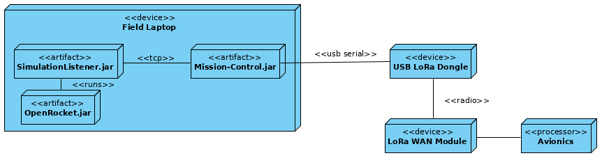

# ENGR 301: Architectural Design and Proof-of-Concept

## Proof-of-Concept

The aim of an architectural proof-of-concept (spike or walking skeleton) is to demonstrate the technical feasibility of your chosen architecture, to mitigate technical and project risks, and to plan and validate your technical and team processes (e.g., build systems, story breakdown, Kanban boards, acceptance testing, deployment).

A walking skeleton is an initial technical attempt that will form the architectural foundation of your product. Since a walking skeleton is expected to be carried into your product, it must be completed to the quality standards expected for your final product. A walking skeleton should demonstrate all the technologies your program will rely on "end-to-end" &mdash; from the user interface down to the hardware.

In the context of ENGR 301, a walking skeleton does not need to deliver any business value to your project: the aim is technical validation and risk mitigation.

## Document

The aim of the architectural design document is to describe the architecture and high-level design of the system your group is to build, to identify any critical technical issues with your design, and to explain how you have addressed the highest rated technical and architectural risks. The architecture document should also demonstrate your understanding of architectural techniques and architectural quality, using tools and associated notations as necessary to communicate the architecture precisely, unambiguously and clearly in a written technical document.

Page specifications below are *limits not targets* and refer to the pages in the PDF generated from the markdown. Because the size of your document is necessarily limited, you should ensure that you focus your efforts on those architectural concerns that are most important to completing a successful system: if sections are at their page limit, indicate how many items would be expected in a complete specification.

The ENGR 301 project architecture design document should be based on the standard ISO/IEC/IEEE 42010:2011(E) _Systems and software engineering &mdash; Architecture description_, plus appropriate sections from ISO/IEC/IEEE 29148:2018(E) _Systems and software engineering &mdash; Life cycle processes &mdash; Requirements engineering_; ISO/IEC/IEEE 15289:2017 _Systems and software engineering &mdash; Content of life-cycle information items (documentation)_; ISO/IEC/IEEE 15288:2015 _Systems and software engineering &mdash; System life-cycle processes_; ISO/IEC/IEEE 12207:2017 _Systems and software engineering &mdash; Software life cycle processes_ and ISO 25010 SQuaRE; with notations from ISO/ISE 19501 (UML). In particular, Annex F of ISO/IEC/IEEE 15288 and Annex F of ISO/IEC/IEEE 12207. These standards are available through the Victoria University Library subscription to the [IEEE Xplore Digital Library](https://ieeexplore.ieee.org/) (e.g., by visiting IEEE Xplore from a computer connected to the University network).

The document should contain the sections listed below, and conform to the formatting rules listed at the end of this brief.

All team members are expected to contribute equally to the document and list their contributions in the last section of the document (please make sure that your continued contribution to this document can be traced in GitLab). You should work on your document in your team's GitLab repository in a directory called "M2_Architecture". If more than one team member has contributed to a particular commit, all those team member IDs should be included in the first line of the git commit message. ``git blame``, ``git diff``, file histories, etc. will be tools used to assess individual contributions, so everyone is encouraged to contribute individually (your contribution should be made to many sections of the document, rather than focusing on just a single section), commit early and commit often.

---

# ENGR 301 *Project 10* Architectural Design and Proof-of-Concept

**Authors:** Nathan Duckett, Timothy Salisbury, Ahad Rahman, Joshua Harwood, Nalin Aswani, Jake (Quang) Mai.

## 1. Introduction

Hobby rockets are very common worldwide, they are typically flown with off the shelf rocket motors with widely available propellant reloads. These hobby rockets can reach the altitude between 30 meters and 760 meters, with velocities exceeding the speed of sound. Uncontrolled rockets are stable based on passive aerodynamic features.
This project will however focus on a controlled rocket, primarily the Mission Control software system. The rocket hardware is designed and built upon the idea of self-stabilization from the Avionics and Control team. The Mission Control software will consider external environmental factors potentially affect the launch such as wind speed, temperature, humidity, rain to decide whether it is safe to launch. On top of that, the simulation software component will be able to statistically predict the rockets flight and the control parameters for the avionics.
The mission control software will run on a laptop at the launch site, display the current software state as well as other associated data with the rocket and the launch. The software also requires a Go/No Go functionality, when a Go signal is given, avionics will be notified in order to start the launch sequence. With the local weather data collected, the mission control software will integrate with the Monte-Carlo rocket simulation to determine if the rocket will land within the defined bounds of the landing area. If not, the software can suggest changing the launch rod angle into the wind to ensure the rocket will land in a permitted landing zone.

### Client

The client for this project is Andre Geldenhuis. He is a rocket enthusiast and a member of the New Zealand Rocketry Association.
Contact email: andre.geldenhuis@vuw.ac.nz

### 1.1 Purpose

The purpose of the system is to create a mission control software centre to collect and display rocket metrics and determine if we are safe to launch based on gather information about weather conditions.

### 1.2 Scope

The Mission Control software will:
* Provide a GUI (Graphical User Interface) to display real-time data from the rocket pre-flight as well as during flight.
* Extend communication channels with the Open Rocket Simulation Software, and with collected weather conditions to determine the launch status (Go/No Go).
* If a Go is given, communication will be made with the Avionics to fire the thruster and charge the parachute.
* Record and log all incoming data from the rocket.

### 1.3 Changes to requirements

N/A

## 2. References

References to other documents or standards. Follow the IEEE Citation Reference scheme, available from the [IEEE website](https://ieee-dataport.org/sites/default/files/analysis/27/IEEE%20Citation%20Guidelines.pdf) (PDF; 20 KB). (1 page, longer if required)

## 3. Architecture

Describe your system's architecture according to ISO/IEC/IEEE 42010:2011(E), ISO/IEC/IEEE 12207, ISO/IEC/IEEE 15289 and ISO/IEC/IEEE 15288.

Note in particular the note to clause 5 of 42010:

_"The verb include when used in Clause 5 indicates that either the information is present in the architecture description or reference to that information is provided therein."_

This means that you should refer to information (e.g. risks, requirements, models) in this or other documents rather than repeat information.

### 3.1 Stakeholders

See ISO/IEC/IEEE 42010 clause 5.3 and ISO/IEC/IEEE 12207 clause 6.4.4.3(2).

For most systems this will be about 2 pages, including a table mapping concerns to stakeholder.

### 3.2 Architectural Viewpoints
(1 page, 42010 5.4)

Identify the architectural viewpoints you will use to present your system's architecture. Write one sentence to outline each viewpoint. Show which viewpoint frames which architectural concern.

### 4. Architectural Views

(5 sub-sections of 2 pages each sub-section, per 42010, 5.5, 5.6, with reference to Annex F of both 12207 and 15288)

Describe your system's architecture in a series of architectural views, each view corresponding to one viewpoint.

You should include views from the following viewpoints (from Kruchten's 4+1 model):

 * Logical
 * Development
 * Process
 * Physical
 * Scenarios - present scenarios illustrating how two of your most important use cases are supported by your architecture

As appropriate you should include the following viewpoints:

 * Circuit Architecture
 * Hardware Architecture

Each architectural view should include at least one architectural model. If architectural models are shared across views, refer back to the first occurrence of that model in your document, rather than including a separate section for the architectural models.

### 4.1 Logical
...

### 4.2 Development
...

### 4.3 Process
Please view the UML State Diagram 'Architectural Process 4-3.png' in assets folder

### 4.4 Physical
The physical topology of our Mission Control software consists of 4 primary components, these are:
* Field Laptop
* USB LoRa Dongle
* LoRa WAN Module
* Avionics </ul>

The field laptop then consists of three main artifacts which are executed on the laptop, these consist of:
* Mission-Control.jar
* SimulationListener.jar
* OpenRocket.jar </ul>

 The below diagram demonstrates how the physical components are connected. The avionics system will be developed
separately, by an independent hardware team. The field laptop will communicate with the avionics system via
LoRa WAN radio signals. This is made possible though the LoRa WAN module broadcasting radio signals on the avionics
system which will be picked up by the USB LoRa dongle connected to the field computer, and vice versa. To make this
possible the mission control software will read and send information through USB serial to the LoRa Dongle.

Rocket simulation software will also run concurrently to the mission control software on the field laptop. The
simulation software (OpenRocket) will be launched with our provided SimulationListener.jar included in its classpath
to allow integration of the two components. The simulation listener will communicate directly with the mission control
 software over TCP to facilitate the mission controls safety functions.  

### 4.5 Scenarios
...

## 5. Development Schedule

_For each subsection, make clear what (if anything) has changed from the requirements document._ If unchanged, these sections should be copied over from the requirements document, not simply cross-referenced.

Schedules must be justified and supported by evidences; they must be either direct client requirements or direct consequences of client requirements. If the requirements document did not contain justifications or supporting evidences, then both must be provided here.

### 5.1 Schedule

Identify dates for key project deliverables:

1. prototype(s).
1. first deployment to the client.
1. further improvements required or specified by the client.

(1 page).

### 5.2 Budget and Procurement

#### 5.2.1 Budget

Present a budget for the project (as a table), showing the amount of expenditure the project requires and the date(s) on which it will be incurred. Substantiate each budget item by reference to fulfilment of project goals (one paragraph per item).

(1 page).

#### 5.2.2 Procurement

Present a table of goods or services that will be required to deliver project goals and specify how they are to be procured (e.g. from the School or from an external organisation). These may be software applications, libraries, training or other infrastructure, including open source software. Justify and substantiate procurement with reference to fulfilment of project goals, one paragraph per item.
(1 page).

### 5.3 Risks

Identify the ten most important project risks: their type, likelihood, impact, and mitigation strategies (3 pages).

### 5.4 Health and Safety

Document here project requirements for Health and Safety.

#### 5.4.1 Safety Plans

Safety Plans may be required for some projects, depending on project requirements.

## 6. Appendices

### 6.1 Assumptions and dependencies

One page on assumptions and dependencies (9.5.7)

### 6.2 Acronyms and abbreviations

One page glossary as required

## 7. Contributions

An one page statement of contributions, including a list of each member of the group and what they contributed to this document.

---

## Formatting Rules

 * Write your document using [Markdown](https://gitlab.ecs.vuw.ac.nz/help/user/markdown#gitlab-flavored-markdown-gfm) in your team's GitLab repository.
 * Major sections should be separated by a horizontal rule.

## Assessment

This document will be weighted at 20% on the architectural proof-of-concept(s), and 80% on the architecture design.

The proof-of-concept will be assessed for coverage (does it demonstrate all the technologies needed to build your project?) and quality (with an emphasis on simplicity, modularity, and modifiability).

The document will be assessed by considering both presentation and content. Group and individual group members will be assessed by identical criteria, the group mark for the finished PDF and the individual mark on the contributions visible through `git blame`, `git diff`, file histories, etc.

The presentation will be based on how easy it is to read, correct spelling, grammar, punctuation, clear diagrams, and so on.

The content will be assessed according to its clarity, consistency, relevance, critical engagement and a demonstrated understanding of the material in the course. We look for evidence these traits are represented and assess the level of performance against these traits. Inspection of the GitLab Group is the essential form of assessing this document. While being comprehensive and easy to understand, this document must be reasonably concise too. You will be affected negatively by writing a report with too many pages (far more than what has been suggested for each section above).

---
