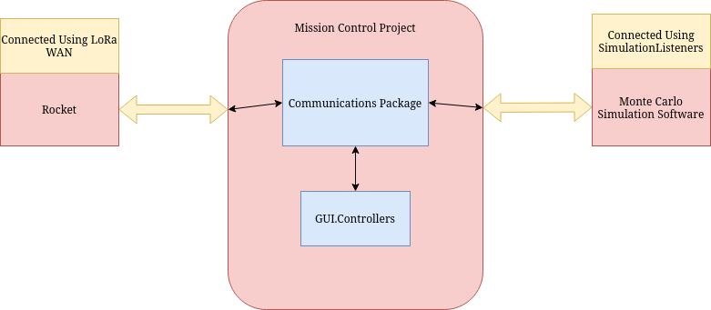
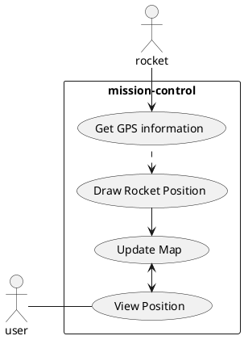
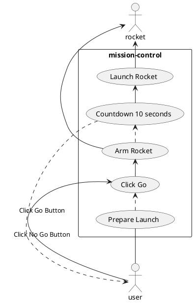
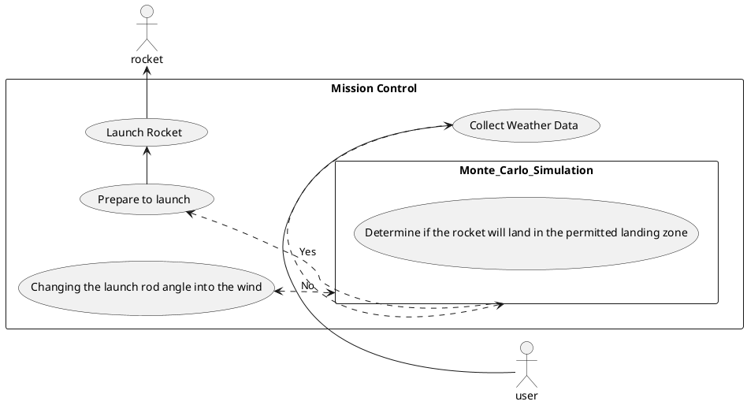

# ENGR 301: Project Requirements Document

The aim of this document is to specify the requirements of the system your group is to build. The focus of a requirements document is the problem you are attempting to solve:  not a first attempt at a solution to that problem. This document should communicate clearly to the supervisor, client and course coordinator what the system you build is going to do, and what constraints it must meet while doing so.

The document should also demonstrate your understanding of the main analysis principles and quality guidelines, and applicable standards, using tools and notations as necessary to communicate the requirements precisely, unambiguously and clearly in a written technical document. Page specifications below are *limits not targets* and refer to the pages in the PDF generated from the markdown. Because the size of your document is necessarily limited, you should ensure that you focus your efforts on those requirements that are most important to completing a successful system: if sections are at their page limit, indicate how many items would be expected in a complete specification.

The ENGR 301 project proposal and requirements document should be based on the standard ISO/IEC/IEEE 29148:2011(E), primarily sections 8.4 and 9.5, plus section 9.4 for projects involving hardware and ISO 25010 SQuaRE for systemic requirements. While excerpts from the standard have been quoted within the template, to understand what is required it will be necessary to read earlier sections of the standards themselves. A supplementary treatment of requirements gathering in engineering projects may be found in [Requirements in Engineering Projects](https://victoria.rl.talis.com/items/F166DA94-DAD8-FBDB-0785-7A63C9BA3603.html?referrer=%2Flists%2F5886F297-2506-1F17-45D9-7F04CEE284EE.html%23item-F166DA94-DAD8-FBDB-0785-7A63C9BA3603) (Talis). The requirements document should contain the sections listed below, and conform to the formatting rules listed at the end of this brief.

All team members are expected to contribute equally to the document and list their contributions in section 6 of the document. You should work on your document in your team's GitLab repository. While collective contributions are expected to be the exception rather than the rule, if more than one team member has contributed to a particular commit then all those team member IDs should be included in the first line of the git commit message. `git blame`, `git diff`, file histories, etc. will be tools used to assess individual contributions, so everyone is encouraged to contribute individually, commit early and commit often. Any team wishing to separate individually contributed sections into a single file before collation into the single proposal document for submission is welcome to do so.

---

# ENGR 301 Project *10* Project Proposal and Requirements Document
#### Author list, a comma-separated list of the names of each member of the team.

## 1. Introduction

One page overall introduction including sections 1.1 and 1.2.

### Client

Andre Geldenhuis - andre.geldenhuis@vuw.ac.nz

### 1.1 Purpose

Create a mission control software centre to display rocket metrics and determine if we are safe to launch.

### 1.2 Scope

The requirements of this project is to provide a graphical interface displaying real-time data provided from the rocket before and during flight. The real-time data will consist of but is not limited to, current rocket state, rocket velocity, altitude, location, and downrange distance. To achieve this we will be required to implement robust communication channels with the rocket, being capable to recover from communication failures at any time.

The mission control software will also have to include communication channels with simulation software (OpenRocket) to display Monte Carlo simulation output. This will be used to determine if the rocket is safe to launch from the destined launch site. Simulation communication channels will also be needed to run simulations at the launch site, with more up-to-date weather conditions. In the case of the simulation returning with a ready-to-launch the mission control will notify the avionics to prime the booster and parachute charges. If the simulation determines that the launch is not safe then mission control can suggest changing the launch rod of the rocket angle to point in towards the wind.

Along with these functionalities mission control should record and log all incoming data from the rocket, this is for debugging and for the capability to replay launches as if they were live.

### 1.3 Product overview
#### 1.3.1 Product perspective

The requirements of this project involve mission control being able to relay data between multiple sources. The mission control is one component within this larger system.
The main purpose of our mission control software is to transmit and receive data between the rocket and our software for visualisation and management during the rocket flight.
Another requirement is that our software is able to communicate with the simulation software developed by other teams to be able to determine if the rocket is safe to launch which can be used as a protection method before launch is allowed.

In this diagram it shows our ideal communication structure between the different components of the Project.
Using the specified communication methods we can provide a standardised communication method between each project.

Both aspects of communication are expected to be handled by our `communications` package which includes methods to communicate using the different interfaces. This module can be easily replaced and is designed to handle our integrations with the other work.

**Rocket Communication:**

The rocket communication is expected to be performed using a Hardware interface. This includes using a USB serial device which contains a LoRa WAN radio which will communicate with the rocket. This radio hardware is expected to provide us with the long range ability to both send and receive data with the rocket component.
The expectation is that our software provides an interface to interact with this hardware which can interpret incoming messages and provide an interface to send a message through the hardware interface.

**Simulation Communication:**

The simulation communication is expected to be performed using a Software interface. In our research we have found that this could be possible using SimulationListeners inside OpenRocket. Their project is expected to be built on top of OpenRocket which already has support for this feature. This will provide us with a message path so that we can receive data from the simulations to verify that launching the rocket is safe.

#### 1.3.2 Product functions
**What is the product?**
 The product that we are creating is a Mission Control Software for rocket simulations. Our product will be portable, and accessible offline, so that we are able to access it while launching rockets on a field. The software will display real time data of a flight simulation if it is taking place, as well as details of previous flight simulations. This data is crucial for flight simulations as is explained further. 

**“Go/No Go” functionality:**
 The “Go/No go” functionality takes all the details available before a launch and makes a decision on whether or not the rocket is safe to launch. We would mainly look at two things, the local current weather conditions and the Monte Carlo Rocket Simulations. Our program would look at the current weather forecast, and decide if it is still safe to launch. I.e it is not raining, hailing, snowing or too windy to launch.  Our program would also look at the results from the Monte Carlo Rocket Simulations and decide if it is safe to launch. There should be a certain percentages of simulations passing for the program to determine if it is still safe to launch. Both of these details are highlighted further. 
Even though the program gives the "Go/No go" call, we will have a "Ready" button which a member of the mission control team would have to press manually. This is in place to ensure safety for only when we are ready to launch.

**Current software state:**
 Our product will show the current software state, which shows what the rocket is currently doing. The software will also need to show if the rocket is about to launch so that the avionics can arm the parachute ejection charges. It will show the current altitude of the rocket in real time to show how high the rocket gets. 

**GPS:**
 As we said before, as an extension we may like to use the wind speed and the monte-carlo simulation to determine an upward trajectory so that we do not veer too far away from the launch site. For this we would also use a GPS tracker for the rocket to determine its location during a real time flight and calculate if we need to make any changes to our calculations. 

**Adding local current weather conditions:**
 For our rocket launch we would need to take the local current weather conditions into consideration. This does not only include the forecast and checking if it is raining for the “Go/No Go” functionality, but also heavily looks at the wind speed, and how this would affect the in flight calculations. 
Our software could potentially go a step further using its wind speed. We expect to use this wind speed into our calculations, so that the rocket does not veer too far away from the exact spot it was launched from. We also expect to use the Monte Carlo Simulation, to determine an upward trajectory, which will be discussed later on. 
We will be looking at the weather using OpenWeatherMap, and their free 3hour API. This means that we can only access the weather every 3 hours.

**Monte Carlo Rocket Simulation:**
 We will be integrating with the Monte Carlo Rocket Simulation. This will run multiple simulations of a rocket launch with slightly different parameters to get an idea of how safe a launch would be. These simulations run as sort of tests for the program to consider if it would be safe to launch considering the current conditions. We would expect a certain percentage of these simulations to pass in order for us to give the “Go” decision for a rocket launch. These simulations could also be used to determine an upward trajectory, or suggest changing the launch rod angle, after taking the wind into consideration. 

#### 1.3.3 User characteristics   

The users for this project are categorised into two main classes: general users and advanced users.
With the project being a Mission Control software system, a bridge that connects the hardware components of the rocket and the Monte Carlo Simulation Software. The general user class is expected to have knowledge to an extent on Hobby Rocketry and how to work with computer software. The general user class should be able to read and comprehend information in the software documentation. For a controlled rocket launch, the user should be able to understand all the information returned by the program and how to control the rocket.

The advanced user class is an extended version of the general user class. Since this is an open-source project, the code base will also be accessible by the users after when the project has been delivered. This means that, the users are able to change the source code of the software system if desired. This class of users is expected to have an advanced knowledge not only on the Hobby Rocketry, but also on programming ability. As mentioned, the users will have access and modify the source code to change the behaviour of the software system. They can collect the log files to gather data if they want to conduct a research on a rocket project. They can also use the code base of our project to extend and created an improved version of our software.

We are aware that that our software system might be shared among the Hobby Rocket community as an open-source project. We will do our best to deliver a software system that works as intended and is compatible on most platform. However, we will not be responsible for any unexpected behaviour from the software system if the source code is modified by users. 

#### 1.3.4 Limitations

One page on the limitations on the product (9.5.6)

Limitations, in reference to this document, will be defined as any restrictions and/or shortcomings of our product that would have otherwise been more ideal given the project requirements.

- **Weather:** Our mission control software should display the current weather. Not only does this help determine if the current conditions allow for safe flying, the wind data can help determine the probable landing position of the rocket. However, due to the inaccessibility of an internet connection at the launching site, obtaining real time weather data is not possible. Our mission control software allows us to download weather data beforehand, which will be used to display weather related information during the rocket's flight.

- **Map Display:** A notable feature our mission control software includes is the ability to see the rocket's location on a map. This is helpful for retrieval of the rocket in case it goes off-course. Likewise to the weather data, the inaccessibility of an internet connections requires us to download map data offline.

- **Must be run locally:** Our mission control software is a Java program that is to be run locally. As opposed to a web-app which can be run on virtually any machine, our program must be downloaded onto the machine that will be used to monitor the rocket during launch and it's flight. This also requires the Java 8 JDK to be installed on the machine.

- **LoRaWAN:** Transmitting data between the rocket and our mission control program will be through LoRaWAN. This means our software's ability to communicate with the rocket is entirely dependent on how reliable and efficient LoraWAN's means of transmitting and receiving data is. This may be a concern as the rocket reaches higher altitudes, but we are yet to conclude anything at this point.

## 2. References

References to other documents or standards. Follow the IEEE Citation  Reference scheme, available from the [IEEE website](https://www.ieee.org/) (please use the search box). (1 page, longer if required)

## 3. Specific requirements  

20 pages outlining the requirements of the system. You should apportion these pages across the following subsections to focus on the most important parts of your product.

### 3.1 External interfaces

1) LoRa WAN - this is a low-powered wide area network which will be used to communicate the data from the rocket to the Mission Control software. Once a LoRa WAN signal is received it is then displayed in the corresponding component of the Mision Control Software

See 9.5.10. for most systems this will be around one page.

### 3.2 Functions

This is typically the longest subsection in the document. List up to fifty use cases (in order of priority for development), and for at least top ten focal use cases, write a short goal statement and use case body (up to seven pages).  Identify the use cases that comprise a minimum viable product.

#### Show Rocket Position

#### Go/No go Functionality

#### Verify Landing Zone prior to launch

### 3.3 Usability Requirements

See 9.5.12. for most systems this will be around one page.

> **9.5.12 Usability requirements** 
> Define usability (quality in use) requirements. Usability requirements and objectives for the software system include measurable effectiveness, efficiency, and satisfaction criteria in specific contexts of use.

### 3.4 Performance requirements

See 9.5.13. for most systems this will be around one page. Hardware projects also see section 9.4.6.

> **9.5.13 Performance requirements**  
> Specify both the static and the dynamic numerical requirements placed on the software or on human interaction with the software as a whole.
>
> Static numerical requirements may include the following:
>
> a) The number of terminals to be supported;  
> b) The number of simultaneous users to be supported;  
> c) Amount and type of information to be handled.
>
> Static numerical requirements are sometimes identified under a separate section entitled Capacity.
>
> Dynamic numerical requirements may include, for example, the numbers of transactions and tasks and the amount of data to be processed within certain time periods for both normal and peak workload conditions. The performance requirements should be stated in measurable terms.
>
>  For example, "_95 % of the transactions shall be processed in less than 1 second._" rather than, "An operator shall not have to wait for the transaction to complete."
>
> NOTE Numerical limits applied to one specific function are normally specified as part of the processing subparagraph description of that function.

### 3.5 Logical database requirements

See 9.5.14. for most systems, a focus on d) and e) is appropriate, such as an object-oriented domain analysis. You should provide an overview domain model (e.g.  a UML class diagram of approximately ten classes) and write a brief description of the responsibilities of each class in the model (3 pages).

You should use right tools, preferably PlantUML, to draw your URL diagrams which can be easily embedded into a Markdown file (PlantUML is also supported by GitLab and Foswiki).

### 3.6 Design constraints

see 9.5.15 and 9.5.16. for most systems, this will be around one page.

> 9.5.15 Design constraints 
> Specify constraints on the system design imposed by external standards, regulatory requirements, or project limitations.
>
> 9.5.16 Standards compliance 
> Specify the requirements derived from existing standards or regulations, including:
>
> a) Report format; 
> b) Data naming; 
> c) Accounting procedures; 
> d) Audit tracing.
>
> For example, this could specify the requirement for software to trace processing activity. Such traces are needed for some applications to meet minimum regulatory or financial standards. An audit trace requirement may, for example, state that all changes to a payroll database shall be recorded in a trace file with before and after values.

### 3.7 Nonfunctional system attributes

Present the systemic (aka nonfunctional) requirements of the product (see ISO/IEC 25010).
List up to twenty systemic requirements / attributes.
Write a short natural language description of the top nonfunctional requirements (approx. five pages).

### 3.8 Physical and Environmental Requirements

For systems with hardware components, identify the physical characteristics of that hardware (9.4.10) and environment conditions in which it must operate (9.4.11).  Depending on the project, this section may be from one page up to 5 pages.

### 3.9 Supporting information

see 9.5.19.

## 4. Verification

3 pages outlining how you will verify that the product meets the most important specific requirements. The format of this section should parallel section 3 of your document (see 9.5.18). Wherever possible (especially systemic requirements) you should indicate testable acceptance criteria.

## 5. Development schedule.

### 5.1 Schedule

Identify dates for key project deliverables:

1. architectural prototype
1. minimum viable product
1. further releases

(1 page).

### 5.2 Budget

Present a budget for the project (table), and justify each budget item (one paragraph per item, one page overall).

### 5.3 Risks

Identify the ten most important project risks to achieving project goals: their type, likelihood, impact, and mitigation strategies (3 pages).

If the project will involve any work outside the ECS laboratories, i.e. off-campus activities, these should be included in the following section.

### 5.4 Health and Safety

Document here project requirements for Health and Safety. All teams must state in this section:

1. How teams will manage computer-related risks such as Occupational Over Use, Cable management, etc.  

2. Whether project work requires work or testing at any external (off-campus) workplaces/sites. If so, state the team's plans for receiving a Health and Safety induction for the external workplaces/sites. If the team has already received such an induction, state the date it was received.

3. Whether project work requires the team test with human or animal subjects? If so, explain why there is no option but for the team to perform this testing, and state the team's plans for receiving Ethics Approval _prior_ to testing.

Also document in this section any additional discussions with the School Safety Officer regarding Health and Safety risks. Give any further information on relevant health and safety regulations, risks, and mitigations, etc.

#### 5.4.1 Safety Plans

Safety Plans may be required for some projects, depending on project requirements. Safety Plan templates are available on the course Health & Safety page. Two questions all teams must answer are:

**Do project requirements involve anything that can cause serious harm or death?**  
Examples: building/modifying devices using voltages > 60 V, chemicals, large moving machinery, flying devices, bodies of water.

If so, you will have to write a separate Safety Plan as part of project requirements, and the Safety Plan must be referenced in this section. For health and safety risks involving serious harm or death, you must first contact the School Safety Officer and Course Coordinator first to discuss the Safety Plan and project requirements.

**Do project requirements involve anything that can cause harm or injury?**  
Examples: building/modifying things with voltages <= 60V, small moving machinery, wearable devices.

If so, you will have to write a separate Safety Plan as part of project requirements, and the Safety Plan must be referenced in this section. For health and safety risks involving harm or injury, you should write a draft of the Safety Plan before contacting the School Safety Officer and Course Coordinator to discuss the Safety Plan and project requirements.

If a safety plan is required, list in this section the date the School Safety officer accepted your Health and Safety plan (if accepted by submission date).

_If the project is purely software and requires no contact risks involving physical harm, then state "Project requirements do not involve risk of death, serious harm, harm or injury." in this section._

## 6. Appendices
### 6.1 Assumptions and dependencies

One page on assumptions and dependencies (9.5.7).

### 6.2 Acronyms and abbreviations

One page glossary _as required_.

## 7. Contributions

A one page statement of contributions, including a list of each member of the group and what they contributed to this document.
### Group Member Contributions:
**Nathan Duckett:**
- Section 1.3.1
- Use cases in section 3.2

---

## Formatting Rules

 * Write your document using [Markdown](https://gitlab.ecs.vuw.ac.nz/help/user/markdown#gitlab-flavored-markdown-gfm) and ensure you commit your work to your team's GitLab repository.
 * Major sections should be separated by a horizontal rule.

## Assessment  

The goal of a requirements document is the problem you are attempting to solve:  not a first attempt at a solution to that problem. The most important factor in the assessment of the document is how will it meet that goal. The document will be assessed for both presentation and content. 

The presentation will be based on how easy it is to read, correct spelling, grammar, punctuation, clear diagrams, and so on.

The content will be assessed according to its clarity, consistency, relevance, critical engagement and a demonstrated understanding of the material in the course. We look for evidence these traits are represented and assess the level of performance against these traits. While being comprehensive and easy to understand, this document must be reasonably concise too. You will be affected negatively by writing a report with too many pages (far more than what has been suggested for each section above).

We aim to evaluate ENGR301 documents and projects as if they were real projects rather than academic exercises &mdash; especially as they are real projects with real clients. The best way to get a good mark in a document is to do the right thing for your project, your client, and your team. We encourage you to raise questions with your tutor or course staff, as soon as possible, so you can incorporate their feedback into your work.

---
