# ENGR 301: Project Requirements Document

The aim of this document is to specify the requirements of the system your group is to build. The focus of a requirements document is the problem you are attempting to solve:  not a first attempt at a solution to that problem. This document should communicate clearly to the supervisor, client and course coordinator what the system you build is going to do, and what constraints it must meet while doing so.

The document should also demonstrate your understanding of the main analysis principles and quality guidelines, and applicable standards, using tools and notations as necessary to communicate the requirements precisely, unambiguously and clearly in a written technical document. Page specifications below are *limits not targets* and refer to the pages in the PDF generated from the markdown. Because the size of your document is necessarily limited, you should ensure that you focus your efforts on those requirements that are most important to completing a successful system: if sections are at their page limit, indicate how many items would be expected in a complete specification.

The ENGR 301 project proposal and requirements document should be based on the standard ISO/IEC/IEEE 29148:2011(E), primarily sections 8.4 and 9.5, plus section 9.4 for projects involving hardware and ISO 25010 SQuaRE for systemic requirements. While excerpts from the standard have been quoted within the template, to understand what is required it will be necessary to read earlier sections of the standards themselves. A supplementary treatment of requirements gathering in engineering projects may be found in [Requirements in Engineering Projects](https://victoria.rl.talis.com/items/F166DA94-DAD8-FBDB-0785-7A63C9BA3603.html?referrer=%2Flists%2F5886F297-2506-1F17-45D9-7F04CEE284EE.html%23item-F166DA94-DAD8-FBDB-0785-7A63C9BA3603) (Talis). The requirements document should contain the sections listed below, and conform to the formatting rules listed at the end of this brief.

All team members are expected to contribute equally to the document and list their contributions in section 6 of the document. You should work on your document in your team's GitLab repository. While collective contributions are expected to be the exception rather than the rule, if more than one team member has contributed to a particular commit then all those team member IDs should be included in the first line of the git commit message. `git blame`, `git diff`, file histories, etc. will be tools used to assess individual contributions, so everyone is encouraged to contribute individually, commit early and commit often. Any team wishing to separate individually contributed sections into a single file before collation into the single proposal document for submission is welcome to do so.

---

# ENGR 301 Project *10* Project Proposal and Requirements Document
#### Author list, a comma-separated list of the names of each member of the team.

## 1. Introduction

One page overall introduction including sections 1.1 and 1.2.

### Client

Andre Geldenhuis - andre.geldenhuis@vuw.ac.nz

### 1.1 Purpose

Create a mission control software centre to display rocket metrics and determine if we are safe to launch.

### 1.2 Scope

The requirements of this project is to provide a graphical interface displaying real-time data provided from the rocket before and during flight. The real-time data will consist of but is not limited to, current rocket state, rocket velocity, altitude, location, and downrange distance. To achieve this we will be required to implement robust communication channels with the rocket, being capable to recover from communication failures at any time.

The mission control software will also have to include communication channels with simulation software (OpenRocket) to display Monte Carlo simulation output. This will be used to determine if the rocket is safe to launch from the destined launch site. Simulation communication channels will also be needed to run simulations at the launch site, with more up-to-date weather conditions. In the case of the simulation returning with a ready-to-launch the mission control will notify the avionics to prime the booster and parachute charges. If the simulation determines that the launch is not safe then mission control can suggest changing the launch rod of the rocket angle to point in towards the wind.

Along with these functionalities mission control should record and log all incoming data from the rocket, this is for debugging and for the capability to replay launches as if they were live.

### 1.3 Product overview
#### 1.3.1 Product perspective

The requirements of this project involve mission control being able to relay data between multiple sources. The mission control is one component within this larger system.
The main purpose of our mission control software is to transmit and receive data between the rocket and our software for visualisation and management during the rocket flight.
Another requirement is that our software is able to communicate with the simulation software developed by other teams to be able to determine if the rocket is safe to launch which can be used as a protection method before launch is allowed.

In this diagram it shows our ideal communication structure between the different components of the Project.
Using the specified communication methods we can provide a standardised communication method between each project.

Both aspects of communication are expected to be handled by our `communications` package which includes methods to communicate using the different interfaces. This module can be easily replaced and is designed to handle our integrations with the other work.

**Rocket Communication:**

The rocket communication is expected to be performed using a Hardware interface. This includes using a USB serial device which contains a LoRa WAN radio which will communicate with the rocket. This radio hardware is expected to provide us with the long range ability to both send and receive data with the rocket component.
The expectation is that our software provides an interface to interact with this hardware which can interpret incoming messages and provide an interface to send a message through the hardware interface.

**Simulation Communication:**

The simulation communication is expected to be performed using a Software interface. In our research we have found that this could be possible using SimulationListeners inside OpenRocket. Their project is expected to be built on top of OpenRocket which already has support for this feature. This will provide us with a message path so that we can receive data from the simulations to verify that launching the rocket is safe.

#### 1.3.2 Product functions
**What is the product?**
 The product that we are creating is a Mission Control Software for rocket simulations. Our product will be portable, and accessible offline, so that we are able to access it while launching rockets on a field. The software will display real time data of a flight simulation if it is taking place, as well as details of previous flight simulations. This data is crucial for flight simulations as is explained further. 

**“Go/No Go” functionality:**
 The “Go/No go” functionality takes all the details available before a launch and makes a decision on whether or not the rocket is safe to launch. We would mainly look at two things, the local current weather conditions and the Monte Carlo Rocket Simulations. Our program would look at the current weather forecast, and decide if it is still safe to launch. I.e it is not raining, hailing, snowing or too windy to launch.  Our program would also look at the results from the Monte Carlo Rocket Simulations and decide if it is safe to launch. There should be a certain percentages of simulations passing for the program to determine if it is still safe to launch. Both of these details are highlighted further. 
Even though the program gives the "Go/No go" call, we will have a "Ready" button which a member of the mission control team would have to press manually. This is in place to ensure safety for only when we are ready to launch.

**Current software state:**
 Our product will show the current software state, which shows what the rocket is currently doing. The software will also need to show if the rocket is about to launch so that the avionics can arm the parachute ejection charges. It will show the current altitude of the rocket in real time to show how high the rocket gets. 

**GPS:**
 As we said before, as an extension we may like to use the wind speed and the monte-carlo simulation to determine an upward trajectory so that we do not veer too far away from the launch site. For this we would also use a GPS tracker for the rocket to determine its location during a real time flight and calculate if we need to make any changes to our calculations. 

**Adding local current weather conditions:**
 For our rocket launch we would need to take the local current weather conditions into consideration. This does not only include the forecast and checking if it is raining for the “Go/No Go” functionality, but also heavily looks at the wind speed, and how this would affect the in flight calculations. 
Our software could potentially go a step further using its wind speed. We expect to use this wind speed into our calculations, so that the rocket does not veer too far away from the exact spot it was launched from. We also expect to use the Monte Carlo Simulation, to determine an upward trajectory, which will be discussed later on. 
We will be looking at the weather using OpenWeatherMap, and their free 3 hour API. This means that we can only access the weather every 3 hours.

**Monte Carlo Rocket Simulation:**
 We will be integrating with the Monte Carlo Rocket Simulation. This will run multiple simulations of a rocket launch with slightly different parameters to get an idea of how safe a launch would be. These simulations run as sort of tests for the program to consider if it would be safe to launch considering the current conditions. We would expect a certain percentage of these simulations to pass in order for us to give the “Go” decision for a rocket launch. These simulations could also be used to determine an upward trajectory, or suggest changing the launch rod angle, after taking the wind into consideration. 

#### 1.3.3 User characteristics   

The users for this project are categorised into two main classes: general users and advanced users.
With the project being a Mission Control software system, a bridge that connects the hardware components of the rocket and the Monte Carlo Simulation Software. The general user class is expected to have knowledge to an extent on Hobby Rocketry and how to work with computer software. The general user class should be able to read and comprehend information in the software documentation. For a controlled rocket launch, the user should be able to understand all the information returned by the program and how to control the rocket.

The advanced user class is an extended version of the general user class. Since this is an open-source project, the code base will also be accessible by the users after when the project has been delivered. This means that, the users are able to change the source code of the software system if desired. This class of users is expected to have an advanced knowledge not only on the Hobby Rocketry, but also on programming ability. As mentioned, the users will have access and modify the source code to change the behaviour of the software system. They can collect the log files to gather data if they want to conduct a research on a rocket project. They can also use the code base of our project to extend and created an improved version of our software.

We are aware that that our software system might be shared among the Hobby Rocket community as an open-source project. We will do our best to deliver a software system that works as intended and is compatible on most platform. However, we will not be responsible for any unexpected behaviour from the software system if the source code is modified by users. 

#### 1.3.4 Limitations

One page on the limitations on the product (9.5.6)

Limitations, in reference to this document, will be defined as any restrictions and/or shortcomings of our product that would have otherwise been more ideal given the project requirements.

- **Weather:** Our mission control software should display the current weather. Not only does this help determine if the current conditions allow for safe flying, the wind data can help determine the probable landing position of the rocket. However, due to the inaccessibility of an internet connection at the launching site, obtaining real time weather data is not possible. Our mission control software allows us to download weather data beforehand, which will be used to display weather related information during the rocket's flight.

- **Map Display:** A notable feature our mission control software includes is the ability to see the rocket's location on a map. This is helpful for retrieval of the rocket in case it goes off-course. Likewise to the weather data, the inaccessibility of an internet connections requires us to download map data offline.

- **Must be run locally:** Our mission control software is a Java program that is to be run locally. As opposed to a web-app which can be run on virtually any machine, our program must be downloaded onto the machine that will be used to monitor the rocket during launch and it's flight. This also requires the Java 8 JDK to be installed on the machine.

- **LoRaWAN:** Transmitting data between the rocket and our mission control program will be through LoRaWAN. This means our software's ability to communicate with the rocket is entirely dependent on how reliable and efficient LoRaWAN's means of transmitting and receiving data is. This may be a concern as the rocket reaches higher altitudes, but we are yet to conclude anything at this point.

## 2. References

References to other documents or standards. Follow the IEEE Citation  Reference scheme, available from the [IEEE website](https://www.ieee.org/) (please use the search box). (1 page, longer if required)

## 3. Specific requirements  

20 pages outlining the requirements of the system. You should apportion these pages across the following subsections to focus on the most important parts of your product.

### 3.1 External interfaces

1) LoRa WAN - this is a low-powered wide area network which will be used to communicate the data from the rocket to the Mission Control software. Once a LoRa WAN signal is received it is then displayed in the corresponding component of the Mission Control Software

See 9.5.10. for most systems this will be around one page.

### 3.2 Functions

This is typically the longest subsection in the document. List up to fifty use cases (in order of priority for development), and for at least top ten focal use cases, write a short goal statement and use case body (up to seven pages).  Identify the use cases that comprise a minimum viable product.

#### Show Rocket Position
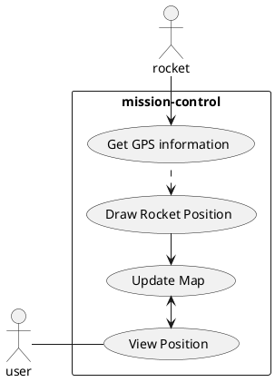

#### Go/No go Functionality
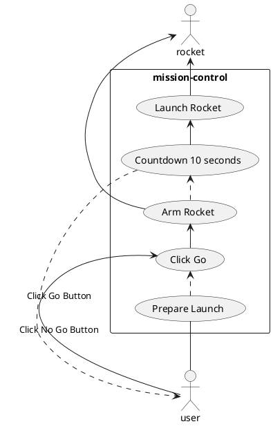

#### Verify Landing Zone prior to launch

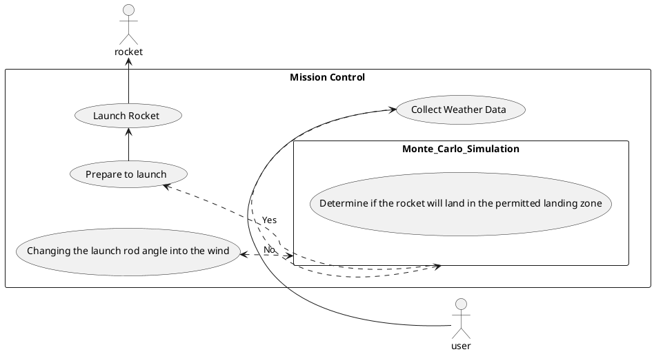

### Run Simulation Data

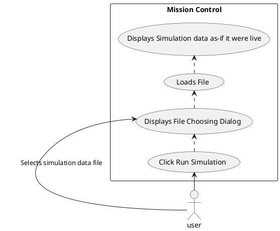

### Update weather data at launch site

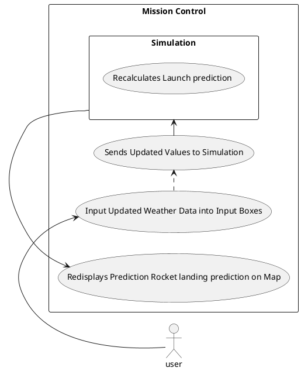

#### View Past Flights

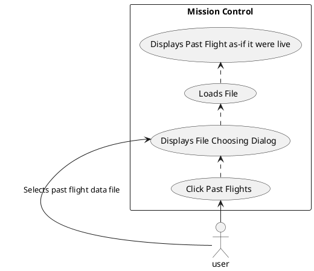

#### Updating Rocket's Current Location on Map

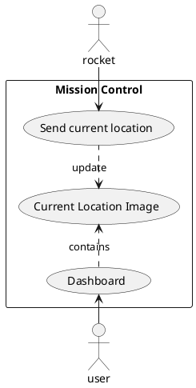

#### Current Software State

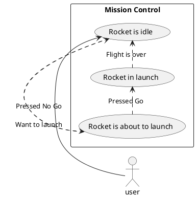

#### Highlight a graph on the UI
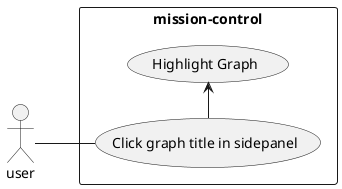

#### Adjust Graph Order
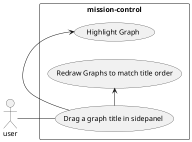

### View Rocket Events in Real Time
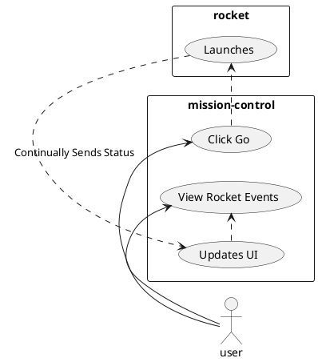

### Display Wind Speed Warning
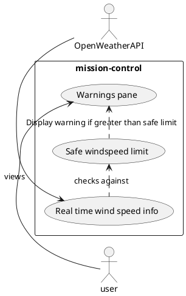

### 3.3 Usability Requirements

- The Mission Control application is expected to be intuitive and easy to pick up out of the box. If this 
requirement is not met it could lead to misuse of the software as the user doesn't understand how the application works
- The application should provide user friendly buttons and/or components that won't cause confusion to the user. If this 
requirement is not met this could lead to failure of components or even potential harm to the user.
- The application is also expected to have a quick and responsive feedback to the user, especially when a rocket is in 
flight. If this requirement is not met it could lead to a delayed response by the user which could result in harm to
the components or bystanders. 
- The application is expected to be stable even when given unexpected inputs, and broken data. Failure to meet this
requirement would lead to loss of control of the rocket.
- The application will display warnings such as low battery, high winds, unsafe landing generated from the simulation.
Failure to prompt the user of these warnings could result in an unsafe launch of the rocket leading to loss of hardware
or potential harm to bystanders.
- The application will display key events from the rocket for the user. This will help the user to understand what is
happening with the rocket when it is out of view, for example parachute deployed.

During development we will coordinate with the customer to make sure that the mission control application meets these
requirements.

### 3.4 Performance requirements

Our application expects to support one user at a time connected at one terminal. The software expects to have a connection made to the rocket via LoRaWAN.
This can allow for multiple mission-control clients to connect using the same connection details but we only will officially support one client connection as specified in our project description.

We expect a varying influx of data from the rocket sent via connections using LoRaWAN. We expect this data to be coming in at near real-time based on our radio connection. Our application should process this information in less than 1 second 99% of the time as the data is streamed into our metrics. The operator should be able to reliably see the application update in a smooth manner showing the change in values as detected by the rocket itself.

Our code is being built to be run on a field laptop at the launch site and as such should be able to match the factors required for the machine like this including:
- Support for smaller screen/resolution to display on a laptop screen.
- Support to run on lower RAM totals and using less cores (e.g. 2-4 cores as standard within laptops)

Ensuring that our code can run smoothly on these machines as our target device must be portable and provide stable performance when monitoring the rocket.

### 3.5 Logical database requirements

See 9.5.14. for most systems, a focus on d) and e) is appropriate, such as an object-oriented domain analysis. You should provide an overview domain model (e.g.  a UML class diagram of approximately ten classes) and write a brief description of the responsibilities of each class in the model (3 pages).

You should use right tools, preferably PlantUML, to draw your URL diagrams which can be easily embedded into a Markdown file (PlantUML is also supported by GitLab and Foswiki).

### 3.6 Design constraints

System design constraints imposed on the project can be broken down into external standards, regulatory requirement and project limitations.

**Design constraints imposed by external standards:**
 - Java Coding Standard: the project will strictly conform to the Google coding conventions from Google Java Style that can be found [here](https://google.github.io/styleguide/javaguide.html). The original authors of this style guide are Max Vetrenko, Ruslan Diachenko and Roman Ivanov, one of our group member Nathan Duckett has made some customisations to this style check. Code committed by all members will have to conform to this coding standard to ensure format consistency, else the pipeline will fail as this is integrated into our CI/CD.
 - Bugs Spotting Standard: the project will must conform to the Bugs Spotting Standard, which is a Java static analyser to find vulnerable code. The standard is also integrated into the CI/CD pipeline, ensuring committed code from all members comply to this standard to minimise bugs.

**Design constraints imposed by regulatory requirements:**
 - Health and Safety constraints: the project must strictly abide by all Health and Safety laws.

**Design constraints imposed by project limitations:**
 - Time constraint: the project follows a fixed time frame from March 2020 (start of the project) until October 2020 (product delivery), half of the project will be done in Trimester 1 and the other half on Trimester 2. We decided to have weekly sprint for our project and hold a retrospective every two weeks. This means that the amount of workload each sprint has to be carefully estimated so that it is evenly distributed among group members, not too overwhelming that we could not finish in a week time, but it also has to meet the project deadline. We would expect to have a working software prototype by the end of Trimester 1. 
 - Costs constraint: this software project has no predicted costs. Each member has our own device to work on, no extra equipment or software license is required.
 - Skills constraint: since our group members are all third-year students, even though some members do have industrial experience, some other members might have limited skills and experience in terms of group collaboration and good coding skills/practices.

### 3.7 Nonfunctional system attributes

Present the systemic (aka nonfunctional) requirements of the product (see ISO/IEC 25010).
List up to twenty systemic requirements / attributes.
Write a short natural language description of the top nonfunctional requirements (approx. five pages).

### 3.8 Physical and Environmental Requirements

For systems with hardware components, identify the physical characteristics of that hardware (9.4.10) and environment conditions in which it must operate (9.4.11).  Depending on the project, this section may be from one page up to 5 pages.

### 3.9 Supporting information

see 9.5.19.

## 4. Verification

3 pages outlining how you will verify that the product meets the most important specific requirements. The format of this section should parallel section 3 of your document (see 9.5.18). Wherever possible (especially systemic requirements) you should indicate testable acceptance criteria.

## 5. Development schedule.

### 5.1 Schedule
* 22/05/2020 Basic UI Implementation - On this date (performance assessment 1) a very minimum UI should be complete, with graphs on display.
* 19/06/2020 Alpha Test - On this date (performance assessment 2) the software should be able to perform a dress rehearsal of a launch, including 
the process of pulling information required to be downloaded and saving it before moving out to the site. This date also signifies the completion
of a dynamic UI framework, which will allow for easy expansion in the future with automatic scaling of components.
* x/x/2020 Simulation Integration - This date signifies the completion of integrating our Mission Control software with the Simulation team's software
 being developed concurrently. 
* x/x/2020 Avionics Integration - This date signifies the completion of integrating our Mission Control software with Hardware team's Avionics hardware
and software being developed concurrently.
* x/x/2020 Test Flight 1 - On this date a test flight should be conducted with involvement of all parties (Mission Control, Simulation, and Avionics).
This test flight will be for purely testing purposes, and any gathered data from the test flight will be used to further improve the usability of our
software.
* x/x/2020 Test Flight 2 - Following the first test flight a second flight should be conducted on this date, with all feedback and gathered data taken
onboard from the first flight to improve our software.   
* x/x/2020 Deployment to Customer - This date signifies the completion of our software and the handover to the customer, Andre Geldenhuis. 

Note: Completion denotes that the majority of the work is complete. It would not make sense to put an exact date on the completion of a software
system seeing as this is an ongoing project, and there may be changes to parts of the software at any given time. 

### 5.2 Budget

We do not expect any expenditure for our project.

### 5.3 Risks

Identify the ten most important project risks to achieving project goals: their type, likelihood, impact, and mitigation strategies (3 pages).

If the project will involve any work outside the ECS laboratories, i.e. off-campus activities, these should be included in the following section.

### 5.4 Health and Safety

In order to manage computer-related risks, all team members are encouraged to take regular breaks (standing up, stretching, resting eyes, doing light exercises, etc.) every 30 minutes to avoid Occupational Overuse Syndrome and Repetitive Strain Injury. It is also highly recommended that each member should set up their workstation ergonomically, to minimise the physical strain on their bodies with prolonged use of computers.

Ideally, a workstation with good ergonomics should have a chair with proper lumbar support and adjustable height; a desk with appropriate height; an external monitor (optional); external mouse and keyboard (optional).
The chair should be adjusted so that the knees is bent at 90 degree angle, the hip should also make a 90 degree angle and the lower back is properly supported by the chair, the elbows should also be at the same level as the desk height.
External mouse and keyboard (if available) should be comfortable enough to be used over a long period of time while maintaining a good posture. The wrists should be in a neutral or straight position when typing, wrist rest or palm rest can assist with this to keep and hands and wrists comfortable.
The height of external monitor (if available) should be adjusted so that with the right posture, the eyes should be at the same height as the top of the monitor. 

Since this is a software project, no physical testing is required. The client will receive the final product digitally.

To ensure the work-life balance of all team members, workload for each sprint will be estimated accordingly so that each member can finish their tickets with 6 to 8 hours of work spent in a week. Communication via Mattermost between everyone is crucial to ensure that members can help one another when someone is stuck on a problem.

All work will be done remotely at each team member's place of residence. The project will not require work at any external workplaces/sites, and so will not require any Health and Safety inductions.

The project will not require any human or animal experimentation.

Any incidents will be reported to the Victoria University of Wellington Safety Officer (Roger Cliffe - ecs-safety@ecs.vuw.ac.nz), Head of School Stuart Marshall and Course Coordinator Aaron Chen in accordance with the Project Management Health and Safety Guide.

#### 5.4.1 Safety Plans

This is a Mission Control software project, therefore project requirements do not involve the risk of death, serious harm, harm or injury.

## 6. Appendices
### 6.1 Assumptions and dependencies

One page on assumptions and dependencies (9.5.7).

### 6.2 Acronyms and abbreviations

One page glossary _as required_.

## 7. Contributions

A one page statement of contributions, including a list of each member of the group and what they contributed to this document.
### Group Member Contributions:
**Nathan Duckett:**
- Section 1.3.1
- Use cases in section 3.2
- Section 3.4
- Section 5.2 (Copied from Architecture Design Document)

**Ahad Rahman:**
- Section 1.3.4
- Use cases in section 3.2

**Jake Mai:**
- Section 1.3.3
- Use cases in section 3.2
- Section 5.4

**Tim Salisbury:**
- Section 1.1
- Section 1.2
- Use cases in section 3.2
- Section 5.1 (Copied from Architecture Design Document)

**Josh Harwood**
- 3.1 External interfaces
- 3.3 Usability Requirements
- Use cases in section 3.2

**Nalin Aswani**
- 1.3.2 Project Functions
- Use cases in section 3.2

## Formatting Rules

 * Write your document using [Markdown](https://gitlab.ecs.vuw.ac.nz/help/user/markdown#gitlab-flavored-markdown-gfm) and ensure you commit your work to your team's GitLab repository.
 * Major sections should be separated by a horizontal rule.

## Assessment  

The goal of a requirements document is the problem you are attempting to solve:  not a first attempt at a solution to that problem. The most important factor in the assessment of the document is how will it meet that goal. The document will be assessed for both presentation and content. 

The presentation will be based on how easy it is to read, correct spelling, grammar, punctuation, clear diagrams, and so on.

The content will be assessed according to its clarity, consistency, relevance, critical engagement and a demonstrated understanding of the material in the course. We look for evidence these traits are represented and assess the level of performance against these traits. While being comprehensive and easy to understand, this document must be reasonably concise too. You will be affected negatively by writing a report with too many pages (far more than what has been suggested for each section above).

We aim to evaluate ENGR301 documents and projects as if they were real projects rather than academic exercises &mdash; especially as they are real projects with real clients. The best way to get a good mark in a document is to do the right thing for your project, your client, and your team. We encourage you to raise questions with your tutor or course staff, as soon as possible, so you can incorporate their feedback into your work.

---
